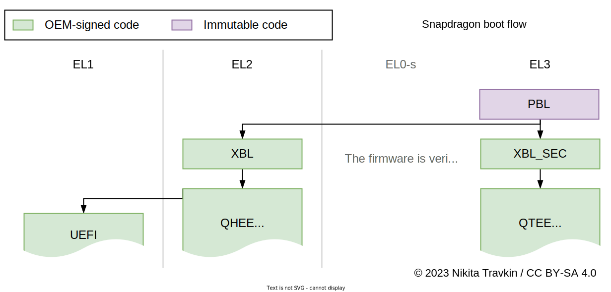
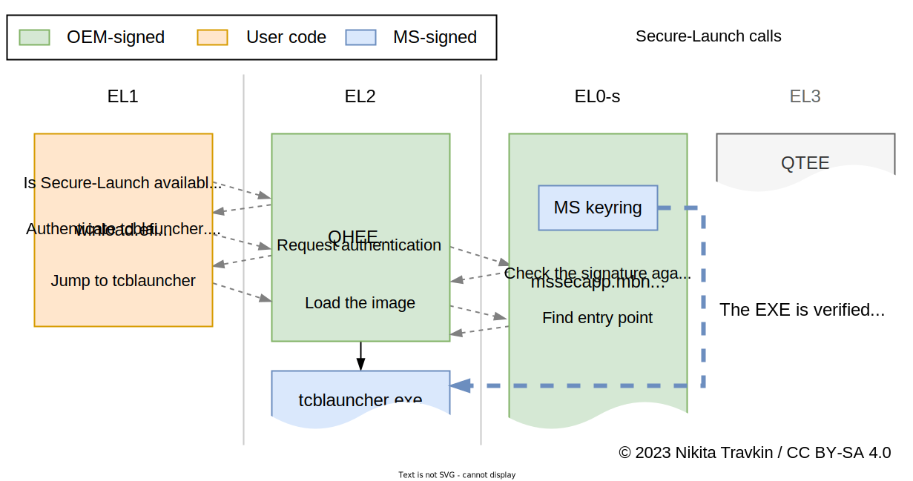
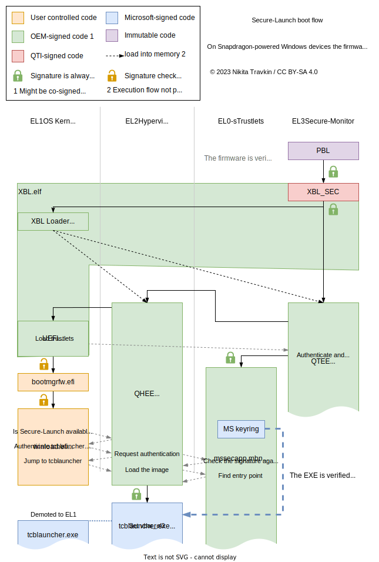

Windows Secure-Launch on Qualcomm devices
========================================

Modern Windows almost always uses Hyper-V to provide certain virtualization
features (i.e. WSL2) or maintain enhanced security (i.e. VBS). On ARM based
devices the hypervisor usually runs in second exception level - EL2 (compared
to EL1 for the OS kernel and EL0 for applications). Normally the OS would
immediately start in EL2, which is mandated by specifications such as
[ARM Base Boot Requirements](https://developer.arm.com/documentation/den0044/latest):

> 7.3.1 AArch64 Exception levels  
> The resident AArch64 UEFI boot-time environment is specified to **use the
> highest 64-bit Non-secure privilege level available.** This level is either
> EL1 or EL2, depending on whether virtualization is used or supported.
> 
> 7.3.1.1 UEFI Boot at EL2  
> **Systems must boot UEFI at EL2**, to allow for the installation of a
> hypervisor or a virtualization-aware operating system.

Unfortunately, Snapdragon based compute platforms don't conform to this
part of the specification, instead booting the UEFI in EL1 despite allowing
virtualization.

This means that the Microsoft bootloader has to rely on some custom mechanism
to take over EL2 and boot the hypervisor. This document attempts to give an
overview of the takeover process, focusing on the intended chain of trust.


### EL2 on Qualcomm devices

Generally, with few exceptions, the EL2 is never available to the user on
Snapdragon devices. On older platforms (like msm8916) the hyp
firmware does absolutely nothing useful and is safe to stub out.
(Which is proven by [qhypstub](https://github.com/msm8916-mainline/qhypstub))
On platforms after that (i.e. msm8937) **the whole EL2 is completely
disabled** (no firmware is loaded and `hvc` instruction is disabled).

On modern platforms, such as Snapdragon "compute" chips used for WoA, the
hypervisor firmware (QHEE) is a bit more involved - Among other things it
emulates the SMMU and provides certain security-related features, intended to
make sure user can't use their device in any exciting way.

Interesting exception from this "norm" are ChromeOS devices that use
ARM Trusted-Firmware instead of the Qualcomm proprietary boot chain and
allow the OS to boot in EL2. The TF-A build still relies on a huge
proprietary library, that [implements all the hw related stuff](https://lists.trustedfirmware.org/archives/list/tf-a@lists.trustedfirmware.org/message/25UDM77JKUSMXATUKJVD5BTDFGHRKBYK/)
but this is still better than what WoA has.


### UEFI and hardware secure-boot

In x86 world, "Secure Boot" is understood as UEFI secure boot - a feature
that allows the UEFI firmware to check the signature of the launched
code against a set of certificates loaded in the firmware keyring.
While this keyring is almost always pre-loaded with Microsoft signing keys,
user can usually either provision their own keys or disable this Secure Boot
feature completely.

Contrary to that, hardware secure boot, often found in embedded systems,
relies on immutable root-of-trust in SoC one-time-programmable memory (such
as e-fuses). This means that if hw-secure-boot is enabled, it's impossible
to disable and launch any code that was not signed with provisioned key.

On Qualcomm devices the root-of-trust is a hash of OEM's signing certificate
burned in SoC e-fuses. Firmware is then checked to be correctly signed with
a certificate matching this hash. Notably, if the hash was never provisioned,
the hardware secure boot is disabled and any valid signature is accepted.
(See also: [qtestsign](https://github.com/msm8916-mainline/qtestsign))

Secure-Launch process
--------------------

> **Note**  
> The following chapter contains references to decompiled code in the
> firmware and Windows bootloader. Only blobs extracted from a retail
> device were used for this research.

### UEFI startup

Initial boot for the SoC is the same as on most other Snapdragon platforms.
The only difference is that the more conventional UEFI firmware "front-end"
is launched instead of the android bootloader.

Qualcomm's [Secure Boot overview v2.0](https://www.qualcomm.com/media/documents/files/secure-boot-and-image-authentication-technical-overview-v2-0.pdf)
suggests that the boot is performed in the following way:




PBL - the SoC bootrom is started as the first code in the system. It's
burned in the chip silicon and is impossible to replace. PBL then loads
XBL and XBL_SEC - insecure and secure bootloaders. Then QTEE (TrustZone) and
QHEE ("hypervisor") are loaded. QHEE then loads the further UEFI firmware in
EL1. All of these components are verified with the hardware secure boot.

The UEFI firmware is then launched in EL1 and loads multiple trustlets into
QTEE. These trustlets provide features such as secure UEFI variables
(`uefisec.mbn`) or Microsoft's TPM and Secure-Launch (`mssecapp.mbn`).
QTEE verifies all trustlets to be signed with the OEM key, following the
hardware secure-boot mechanism.

After that, UEFI can load the OS or provide the firmware configuration menu
to the user. At this point UEFI would use it's own secure boot, based on a
mutable keyring stored in the efivars (which is baked by the trustlet).
Here user can make a choice to disable UEFI secure boot and load arbitrary
code in EL1. This is similar to "OEM Unlock" on some Android devices, in
both cases user can't access higher levels such as EL2.

### Windows boot and EL2 takeover

To boot Windows, UEFI launches the Windows Boot Manager (`bootmgrfw.efi`).
The Boot Manager then launches the windows bootloader (`winload.efi`, note
that despite the extension, this is *windows boot application*, incompatible
with UEFI). These blobs are verified with the UEFI secure-boot and can be
freely modified or replaced by disabling SB or editing the boot manager
configuration (`BCD`) to disable the integrity checks.

If BCD configuration tells winload.efi that virtualization is disabled,
it continues to launch the OS in EL1. Otherwise the *Secure-Launch* is
initiated.



winload.efi runs `OslpTcbLaunchPhase0` to load the `tcblaunch.exe` and
launch it in EL2. The `SlpAppStart` performs multiple secure-monitor (`smc`)
calls to verify the image and boot it in the EL2:

```c
ulonglong SlpAppStart(...,longlong pe_base,uint pe_size,...)
{
// ...
    arg_data = SlpAllocateSecureLaunchContext();
    if (arg_data >= 0) {
        data = (seclaunch_message *)((longlong)&(SecureLaunchState.LaunchContext)->phys_addr
                + (SecureLaunchState.LaunchContext)->page_size);
                
        /* Always returns 0. (Check if SL is available?) */
        tmp1 = BlArch64IssueSmc(data,1);
        // ...
        if ((tmp1 >= 0) && (arg_data = SlpBuildBootApplicationParameters(arg_data,param_1), arg_data >= 0)) {
            SlpInitializeTransitionContext();
            // ...
            data->pe_data = SecureLaunchState.pe_base_copy;
            data->pe_size = SecureLaunchState.pe_size;
            data->arg_data = (SecureLaunchState.LaunchContext)->big_buffer->this_addr_phys;
            data->arg_size = (SecureLaunchState.LaunchContext)->big_buffer->some_size_for_launch_smc;
            
            /* Authenticate the image. */
            iVar2 = BlArch64IssueSmc(data,2);
            if (iVar2 >= 0) {
                // ...
                /* Jump to the image in EL2 */
                iVar2 = BlArch64IssueSmc(data,4);
                //...
            }
            // ...
        }
    }
    // ...
}
```

The code passes the PE application and the data structure containing the
launch parameters.

The SMC calls get intercepted by the QHEE's `hyp_manager_launch`:

The first call only sets a flag and returns.
```c
// ...
    if (num == 1) {
        ret = 0;
        secure_launch_state = secure_launch_state | 8;
    }
// ...
```

The second call passes the image data to the `mssecapp` to authenticate:

```c
// ...
        switch(num) {
        case 2:
            // ...
            else {
                //...
                if (cVar2 || !iVar3) {
                    iVar3 = FUN_80046e98(); // some smc call
                    if (iVar3 == -0xc) { ret = 0x37; }
                    else {
                        /* Make a call to the TZ and check the image */
                        ret = hyp_manager_lookup_mssecapp_id(smcParams,2,0);
                        if (ret) {
                            err_str = "hyp_manager_handle_auth: hyp_manager_tzapp_send failed\n";
                            goto error;
                        }
                        secure_launch_state = secure_launch_state | 2;
                    }
                    break;
                }
                //...
            }
            print_msg(3,err_str);
            ret = 0x11;
            break;
        // ...
        }
// ...
```

The third call checks for the flag set by the second and, if the
flag is set, asks `mssecapp` for the entry point address and jumps to the
image:

```c
// ...
        switch(num) {
        // ...
        case 4:
            if (((byte)secure_launch_state >> 1 & 1) == 0)
                goto not_authenticated;
            // ...
            else {
               // ...
                else {
                    /* Get the entry point address for the PE */
                    ret = hyp_manager_lookup_mssecapp_id(smcParams,4,&image_addr);
                    
        // ...
        
                print_msg(2,"hyp_manager_handle_launch: Jumping to Image:0x%x",image_addr);
                print_msg(2,"hyp_manager_handle_launch: Address of params:0x%x",&params_data);
                // ...
                Jump_to_loaded_image(image_addr,&params_data);
                print_msg(4,"Secure Launch should never return!");
        // ...
        }
// ...
```

After the third call the `tcblaunch.exe` takes control of EL2.
`BlSlEntryPoint` is called with the parameters passed. This function sets
up the stack, performs some validation on the input data before overriding
the `vbar_el2` with a new exception vector and demoting itself to EL1. Then
it continues the boot process.

When the second call happens, the image is verified by the `mssecapp` in the
`VerifyApp` function. Similarly to how [drivers are checked](https://www.iasj.net/iasj/download/40eb00455c0a5a1f) in Windows, the `MinCrypL_CheckSignedFile`
is used to verify that the PE is signed with a Microsoft key. The keyring
for the check is hardcoded in the `mssecapp.mbn`, which, in combination with
the fact that the trustlet is also signed with the OEM secure-boot key,
establishes a continuous chain-of-trust for Secure-Launch, meaning **only
Microsoft-approved code is intended to run in EL2 on these Qualcomm devices**.

In practice this means, that the firmware, by it's design, implements
vendor-lock-in for the Microsoft OS, locking down some features of the hardware,
like virtualization, behind a paywall (VM features in Windows are only available
in pro SKUs). One could speculate that a conspiracy between Microsoft and
Qualcomm takes place, however it might be as likely that this is a result of
Qualcomm's stubbornness and/or Microsoft's ignorance on the matter.

A full boot-flow chart for Secure-Launch:




Future ideas
------------

While the Secure-Launch implementation makes sure that no alternative OS
can launch in EL2 out of the box, it might be possible to make use of some
Windows boot chain components, such as `tcblaunch.exe` in a way, that would
allow arbitrary code to run. While `mssecapp` takes a measurement of the
data struct passed to the `tcblaunch`, presumably into the Microsoft's TPM,
it might allow one to pass specially crafted launch data that would run
user code right after `tcblaunch` demotes to EL1.

The specially crafted data would have to at least pass the checks inside
the `mssecapp`, which include having correct size fields; passing some
signing certificate for the payload PE and passing the measurement process,
that fills some information in the passed data structure.

After that the same structure should be good enough for `tcblaunch` to
get to setting the `vbar_el2`: it should be able to use a provided stack;
successfully map all the memory and at the very least fail validating the
next stage boot parameters, jumping to the failure path code, provided in
the data struct.

Since at this point the EL2 interrupt vector is already set to the TCB one,
such user code could easily elevate back to EL2 by just making a `hvc #1`
hypercall.

A simple, incomplete and broken PoC of booting the `tcblaunch.exe` can
be found in the `slplaunch` directory in this repo. It has minimal code
to run Secure-Launch process with an arbitrary PE but doesn't have
any data payload which makes it fail the checks.

